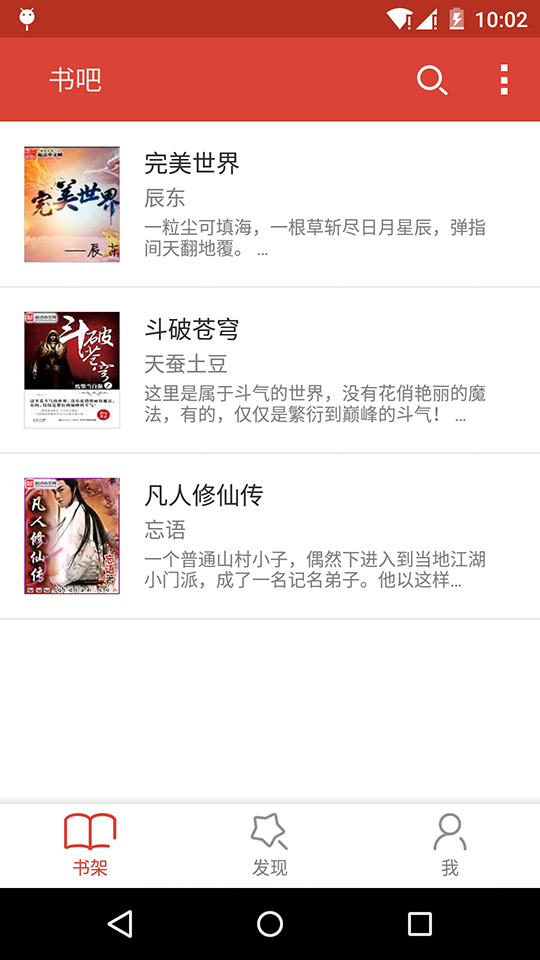
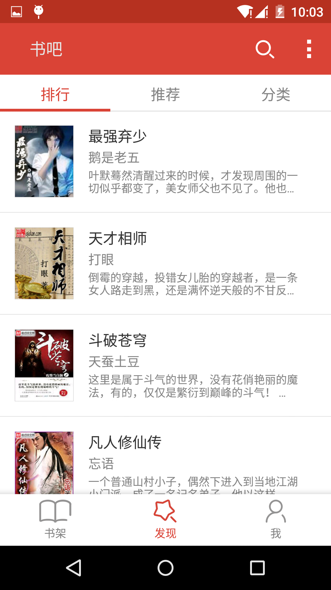
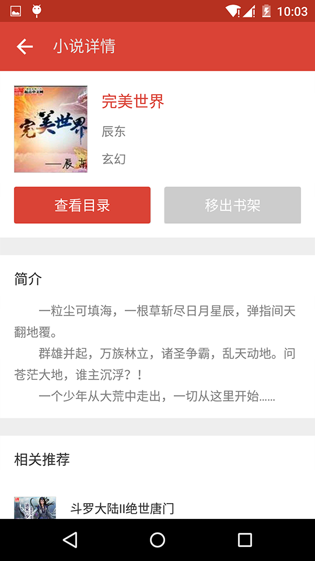
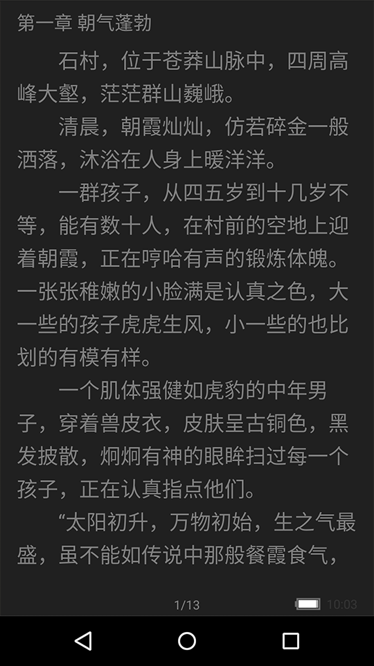

书吧
==============
Find the best novel for users.

* Quickly and Automatic.
* Wonderful user experience.
* For free and without ad.
* Send the update message to users.

书吧，专注为用户提供人性化的搜书引擎，快捷，方便，为用户找到最好的小说。

* 快捷的搜索网络小说，自动为用户筛选最好的小说来源。
* 人性化的阅读体验，精致的内容排版。
* 绿色无广告，并自动过滤小说内容中的错别字和无用广告。
* 检查小说更新，更新后推送消息，让用户及时阅读最新内容。 

[][1]

##Screenshots
###书架

###发现

###小说详情

###阅读页面－夜间模式

##Open Source Libraries Used

* [dagger](https://github.com/square/dagger)
* [butterknife](https://github.com/JakeWharton/butterknife)
* [rebound](https://github.com/facebook/rebound)
* [universal-image-loader](https://github.com/nostra13/Android-Universal-Image-Loader)
* [android-async-http](https://github.com/loopj/android-async-http)
* [viewpagerindicator](https://github.com/JakeWharton/ViewPagerIndicator)
* [aframework](https://github.com/liuguangqiang/AFramework)
* [AndroidMVP](https://github.com/liuguangqiang/AndroidMVP)

##License

    Copyright 2015 qiwenge

    Licensed under the Apache License, Version 2.0 (the "License");
    you may not use this file except in compliance with the License.
    You may obtain a copy of the License at

       http://www.apache.org/licenses/LICENSE-2.0

    Unless required by applicable law or agreed to in writing, software
    distributed under the License is distributed on an "AS IS" BASIS,
    WITHOUT WARRANTIES OR CONDITIONS OF ANY KIND, either express or implied.
    See the License for the specific language governing permissions and
    limitations under the License.

[1]:https://play.google.com/store/apps/details?id=com.qiwenge.android